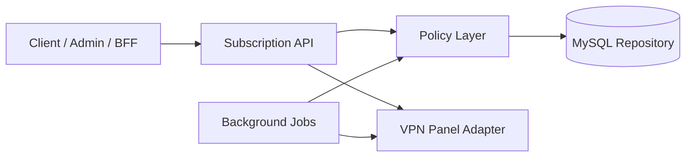

# NKVPN Subscription API

Public engineering case study for the subscription backend behind a VPN SaaS platform. The production system provisions VPN access, enforces device and traffic policies, synchronizes provider state, and keeps user subscriptions reliable across multiple VPN nodes.

This repository is a sanitized showcase: it demonstrates the architecture, contracts, policy layer, tests, and production thinking without exposing private provider integrations or customer data.

## Problem

VPN products are deceptively simple from the user's point of view: a user buys access and receives a working subscription link. Under the hood, the platform needs to coordinate multiple concerns:

- users can have different subscription periods and traffic limits;
- device limits must be enforced consistently;
- provider panels can fail, lag, or drift from local state;
- background cleanup and repair jobs must not corrupt active subscriptions;
- support/admin tools need a reliable source of truth.

The core problem is keeping subscription state predictable while interacting with external VPN infrastructure.

## Solution

The API is designed around a clear domain boundary:

- HTTP endpoints expose a stable contract for product surfaces.
- A policy layer decides whether a user can access or mutate a subscription.
- Provider adapters handle infrastructure-specific provisioning.
- Background jobs reuse the same domain services as request handlers.
- Audit-friendly state is stored in MySQL in the private implementation.

## Key Features

- Subscription summary and lifecycle state.
- Device registration policy.
- Traffic limit and expiration decision points.
- Provider adapter boundary.
- Background repair/cleanup job model.
- OpenAPI contract for frontend/admin consumers.
- Unit-tested policy decisions.

## Architecture



The important design choice is that policy decisions happen before provider calls. This makes access rules deterministic and testable, and avoids unnecessary provider mutations when local rules already reject a request.

See `docs/architecture.md` for the sequence diagram and service boundaries.

## Tech Stack

- Node.js, TypeScript, Express.
- MySQL in the production system.
- OpenAPI for API contracts.
- Vitest for policy unit tests.
- GitHub Actions for CI.

## Engineering Highlights

- `docs/adr/0001-policy-layer-before-provider-adapters.md` documents why policy logic is separated from provider adapters.
- `docs/openapi.yaml` defines a public-safe API contract.
- `examples/device-limit/deviceLimitPolicy.ts` demonstrates a deterministic access decision.
- `tests/deviceLimitPolicy.test.ts` covers allowed, inactive, and limit-reached states.
- `docs/production.md` covers idempotency, provider retries, observability, audit events, and data integrity.

## Production Considerations

In production, this service needs to handle retries, provider outages, traffic sync lag, cleanup jobs, and admin-initiated changes. The private implementation treats subscription mutations as stateful operations that must be auditable and safe to retry.

Important production concerns:

- idempotent device/subscription mutations;
- provider call retries with bounded backoff;
- audit logs for admin changes;
- alerts for failed provisioning and stuck background jobs;
- transactions around critical state changes.

## Public vs Private

Included in this repository:

- sanitized architecture docs;
- OpenAPI contract examples;
- policy-layer code sample;
- tests and CI setup;
- ADR and production notes.

Excluded from this repository:

- real subscription link generation;
- VPN panel credentials and cookies;
- server inventory and routing rules;
- production traffic logs;
- customer data;
- deployment and maintenance scripts.

## Local Development

```bash
npm install
npm run typecheck
npm test
```

## Roadmap

See `docs/roadmap.md` for the scaling plan: provider adapter tests, idempotency middleware, queue-backed sync jobs, read replicas, and incident playbooks.
