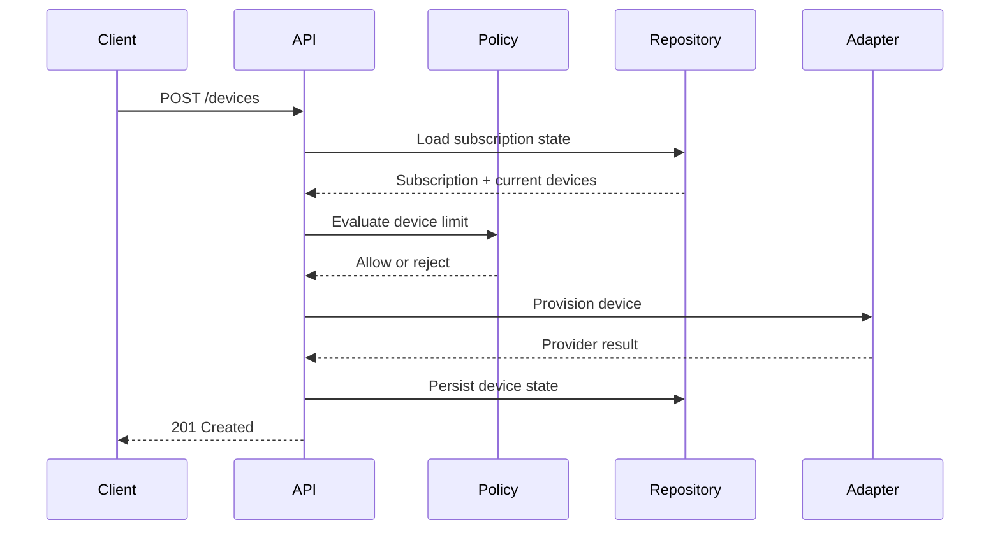

# Architecture

```text
HTTP API -> Subscription Service -> Repository -> MySQL
              |        |
              v        v
       Policy Layer  VPN Panel Adapter
              |
              v
        Background Jobs
```

## Notes

- Policies are separated from provider adapters.
- Background jobs reuse the same domain services as HTTP endpoints.
- Provider-specific details are hidden behind adapter interfaces.
- Access decisions are deterministic and testable.

## Sequence: Device Registration


